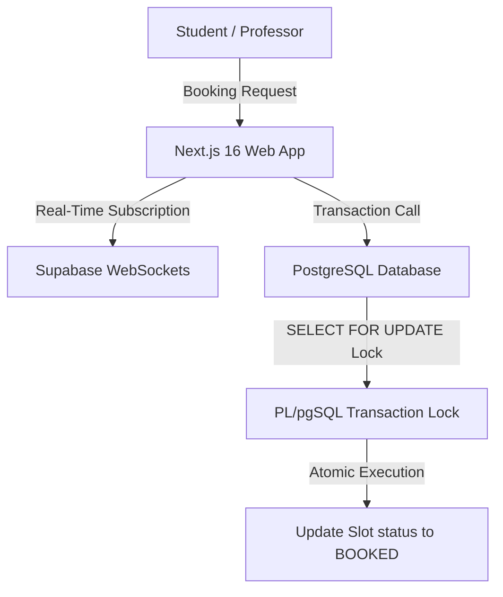

# 🌿 AmSlot: Real-Time Academic Review Scheduler
    

## 📋 Table of Contents
- [Project Overview](#-project-overview)
- [What This Project Does](#-what-this-project-does)
- [Key Innovation](#-key-innovation)
- [Performance Highlights](#-performance-highlights)
- [Architecture](#-architecture)
- [Methodology & Technical Details](#-methodology--technical-details)
- [Project Structure](#-project-structure)
- [Tech Stack](#-tech-stack)
- [Quick Start](#-quick-start)

---

## 🎯 Project Overview
AmSlot is an academic slot scheduler designed to eliminate evaluation booking conflicts. It utilizes atomic row-level transaction locks (`SELECT FOR UPDATE`) in PL/pgSQL database functions and integrates Supabase WebSockets for real-time availability synchronization.

---

## 🚀 What This Project Does
* **The Challenge:** Severe slot booking conflicts and race conditions when multiple student groups attempt to reserve the same review slots simultaneously.
* **Our Solution:** A robust Next.js scheduling platform that locks PostgreSQL rows during evaluation bookings, communicating state updates instantly via Supabase WebSockets.

---

## 🔬 Key Innovation
| Feature | Traditional Approach ❌ | AmSlot Solution ✅ | Benefit |
|---------|------------------------|--------------------|---------|
| **Race Conditions** | Optimistic concurrency checking causing booking failures | **Row-level database locks (`SELECT FOR UPDATE`)** | Guarantees atomic bookings under high loads |
| **Real-time Sync** | HTTP polling or periodic page refreshes | **Supabase WebSockets** | Instantly syncs slot availability across clients |
| **Relational Integrity** | Denormalized document stores | **8 normalized relational tables** | Ensures clean user-group-course mapping |

---

## 📊 Performance Highlights
- ✅ **Atomic locks** executing under 20ms.
- ✅ **Real-time state broadcast** synchronizing 180+ active student dashboards.
- ✅ **Multi-tenant layout** separating views for students, student groups, and academic evaluators.

---

## 🏗️ Architecture


---

## ⚙️ Methodology & Technical Details
### Concurrency Control & Database Locking
To resolve race conditions during peak registration hours, AmSlot implements strict pessimistic locking inside its database layer. When a slot is requested, the system runs a PL/pgSQL transaction with a `SELECT ... FOR UPDATE` statement:
```sql
CREATE OR REPLACE FUNCTION book_review_slot(slot_id UUID, group_id UUID)
RETURNS BOOLEAN AS $$
BEGIN
    -- Acquire pessimistic lock on the slot row
    PERFORM 1 FROM slots WHERE id = slot_id AND status = 'AVAILABLE' FOR UPDATE;
    IF FOUND THEN
        UPDATE slots SET status = 'BOOKED', booked_by = group_id WHERE id = slot_id;
        RETURN TRUE;
    END IF;
    RETURN FALSE;
END;
$$ LANGUAGE plpgsql;
```
This guarantees that once a transaction grabs a row, concurrent requests for the same slot must wait, preventing double-bookings.

### Real-Time Update Pipeline
Supabase's PostgreSQL Replication Service (WAL) detects updates on the `slots` table and pushes them via WebSockets to the client. Active React components listen to the subscription channel and immediately transition the slot color from green (Available) to red (Booked) without requiring page reloads.

---

## 📂 Project Structure
```
amslot-web/
├── app/                  # Next.js App Router folders
│   ├── layout.tsx        # Base document layout
│   ├── page.tsx          # Real-time dashboard view
│   └── api/              # API endpoints for auth & database transactions
├── components/           # Reusable UI widgets
│   ├── SlotGrid.tsx      # Main slot matrix selector
│   └── UserDashboard.tsx # Profile information pane
└── database/             # Database migration setup
    └── schema.sql        # Tables schema and PL/pgSQL locking triggers
```

---

## 🧱 Tech Stack
- Next.js 16 & React 19 (App Router)
- Supabase for Auth & Real-Time Sync
- PostgreSQL with custom PL/pgSQL database functions
- Framer Motion for fluid UI transitions

---

## 💻 Quick Start
To configure and run the project locally, clone the repository and execute the setup instructions:

```bash
git clone https://github.com/Raghuram-sekar/AmSlot.git
cd AmSlot

# Execute local setup commands:
npm install
npm run dev
```
